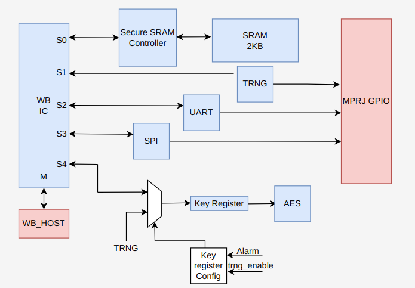
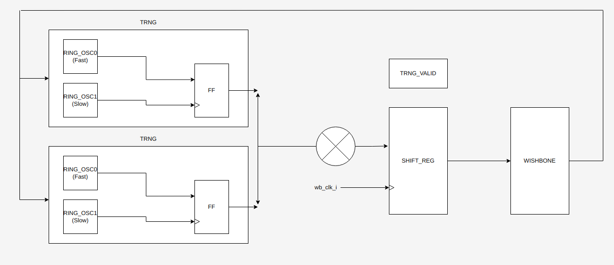

# Secure Memory with AES

[](https://opensource.org/licenses/Apache-2.0)

## Table of contents
- [Secure Memory](#secure-memory)
  - [Table of contents](#table-of-contents)
  - [Overview](#overview)
  - [Basic Macros](#basic-macros)
  - [Prerequisites](#prerequisites)
    - [Step-1: Docker in ubuntu 20.04 version](#step-1-docker-in-ubuntu-2004-version)
    - [Step-2: Clone caravel user project](#step-2-clone-caravel-user-project)
    - [Step-3: Setup your local environment](#step-3-setup-your-local-environment)
    - [Step-4: To install required repos](#step-4-to-install-required-repos)
    - [Step-5: Harden design](#step-5-harden-design)
    - [Step-6 Simulation](#step-6-simulation)
    - [Step-7 Precheck](#step-7-precheck)
  - [Openlane Flow](#openlane-flow)

## Overview

Keeping your data secure. This project aims to secure data from adversaries. It has inherent SRAM to keep the data safe and they are kept as not plaintext but ciphered. We got 5 macros inherently in order to accomplish our goal. Below section will be described those macros briefly.
<table>
  <tr>
    <td  align="center"></td>
  </tr>
</table>

## Basic Macros

- `TRNG` - True random number generator. Ring oscillator macro which is one of the inner macros of caravel core, is used. In this macro, delay buffers are used instead of not gates. It can be also used as key generator for AES.

<table>
  <tr>
    <td  align="center"></td>
  </tr>
</table>

- `SPI`  - SPI pins are connected to GPIO pins which is spared for user project. User can read/write data from/to SRAM via SPI.
- `UART` - UART pins are connected to GPIO pins which is spared for user project. User can read/write data from/to SRAM via UART.
- `AES`  - Cipher plaintext to keep data safe in SRAM.
- `SRAM` - Our precious. Its 1KB.

All these macros are in located in the `verilog/rtl/` directory.

## Prerequisites
   - Docker (ensure docker daemon is running) -- tested with version 19.03.12, but any recent version should suffice.
### Step-1: Docker in ubuntu 20.04 version
```bash
   sudo apt update
   sudo apt-get install apt-transport-https curl rtificates -agent software-properties-common
   curl -fsSL https://download.docker.com/linux/ubuntu/gpg | sudo apt-key add -
   sudo add-apt-repository "deb [arch=amd64] https://download.docker.com/linux/ubuntu focal stable"
   sudo apt update
   apt-cache policy docker-ce
   sudo apt install docker-ce

   #Add User Name to docker
   sudo usermod -aG docker <your user name>
   # Reboot the system to enable the docker setup
```
### Step-2: Clone caravel user project
```bash
   git clone -b mpw-5c https://github.com/efabless/caravel_user_project
```
### Step-3: Setup your local environment
```bash
    export CARAVEL_ROOT=<Caravel Installed Path>
    export PDK_ROOT=<PDK Installed PATH>
    export UPRJ_ROOT=<Caravel User Project Installed Path>
    export OPENLANE_ROOT=<OpenLane Installed Path>
    export OPENLANE_IMAGE_NAME=efabless/openlane:2022.02.23_02.50.41
```

### Step-4: To install required repos
```bash
   source ~/.bashrc
   cd $UPRJ_ROOT
   make install # install pdk. pdk with sram, openlane. caravel and mgmt core
```

### Step-5: Harden design
A subdirectory for each macro in your project under openlane/ directory, each subdirectory should include openlane configuration files for the macro
```bash
   make <module_name>
   make user_project_wrapper
```

### Step-6 Simulation
Examples:
``` sh
    # you can then run RTL simulations using
    make verify-<testbench-name>-rtl

    # or GL simulation using
    make verify-<testbench-name>-gl

    # for example
    make verify-wb_port-rtl
```

### Step-7 Precheck
``` sh
    make precheck
    make run-precheck
```

## Openlane Flow

Mbist Controller flow uses Openlane tool sets.

1. **Synthesis**
    1. `yosys` - Performs RTL synthesis
    2. `abc` - Performs technology mapping
    3. `OpenSTA` - Pefroms static timing analysis on the resulting netlist to generate timing reports
2. **Floorplan and PDN**
    1. `init_fp` - Defines the core area for the macro as well as the rows (used for placement) and the tracks (used for routing)
    2. `ioplacer` - Places the macro input and output ports
    3. `pdn` - Generates the power distribution network
    4. `tapcell` - Inserts welltap and decap cells in the floorplan
3. **Placement**
    1. `RePLace` - Performs global placement
    2. `Resizer` - Performs optional optimizations on the design
    3. `OpenPhySyn` - Performs timing optimizations on the design
    4. `OpenDP` - Perfroms detailed placement to legalize the globally placed components
4. **CTS**
    1. `TritonCTS` - Synthesizes the clock distribution network (the clock tree)
5. **Routing**
    1. `FastRoute` - Performs global routing to generate a guide file for the detailed router
    2. `CU-GR` - Another option for performing global routing.
    3. `TritonRoute` - Performs detailed routing
    4. `SPEF-Extractor` - Performs SPEF extraction
6. **GDSII Generation**
    1. `Magic` - Streams out the final GDSII layout file from the routed def
    2. `Klayout` - Streams out the final GDSII layout file from the routed def as a back-up
7. **Checks**
    1. `Magic` - Performs DRC Checks & Antenna Checks
    2. `Klayout` - Performs DRC Checks
    3. `Netgen` - Performs LVS Checks
    4. `CVC` - Performs Circuit Validity Checks
